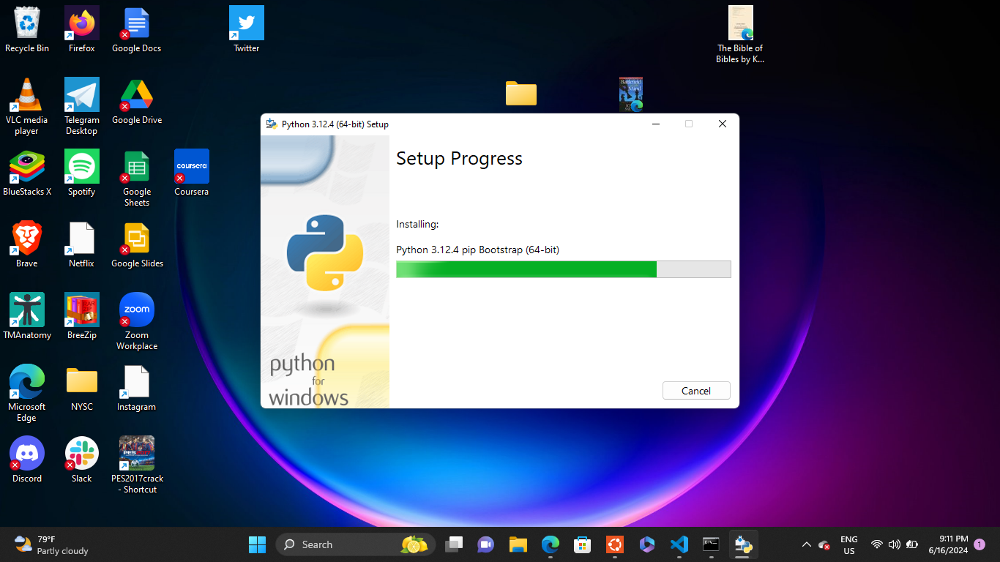

# Dev_Setup
Setup Development Environment

#Assignment: Setting Up Your Developer Environment

#Objective:
This assignment aims to familiarize you with the tools and configurations necessary to set up an efficient developer environment for software engineering projects. Completing this assignment will give you the skills required to set up a robust and productive workspace conducive to coding, debugging, version control, and collaboration.

#Tasks:

1. Select Your Operating System (OS):
   Choose an operating system that best suits your preferences and project requirements. Download and Install Windows 11. https://www.microsoft.com/software-download/windows11

2. Install a Text Editor or Integrated Development Environment (IDE):
   Select and install a text editor or IDE suitable for your programming languages and workflow. Download and Install Visual Studio Code. https://code.visualstudio.com/Download
3. Set Up Version Control System:
   Install Git and configure it on your local machine. Create a GitHub account for hosting your repositories. Initialize a Git repository for your project and make your first commit. https://github.com

4. Install Necessary Programming Languages and Runtimes:
  Instal Python from http://wwww.python.org programming language required for your project and install their respective compilers, interpreters, or runtimes. Ensure you have the necessary tools to build and execute your code.

5. Install Package Managers:
   If applicable, install package managers like pip (Python).

6. Configure a Database (MySQL):
   Download and install MySQL database. https://dev.mysql.com/downloads/windows/installer/5.7.html

7. Set Up Development Environments and Virtualization (Optional):
   Consider using virtualization tools like Docker or virtual machines to isolate project dependencies and ensure consistent environments across different machines.

8. Explore Extensions and Plugins:
   Explore available extensions, plugins, and add-ons for your chosen text editor or IDE to enhance functionality, such as syntax highlighting, linting, code formatting, and version control integration.

9. Document Your Setup:
    Create a comprehensive document outlining the steps you've taken to set up your developer environment. Include any configurations, customizations, or troubleshooting steps encountered during the process. 

#Deliverables:
- Document detailing the setup process with step-by-step instructions and screenshots where necessary.
- A GitHub repository containing a sample project initialized with Git and any necessary configuration files (e.g., .gitignore).
- A reflection on the challenges faced during setup and strategies employed to overcome them.

#Submission:
Submit your document and GitHub repository link through the designated platform or email to the instructor by the specified deadline.

#Evaluation Criteria:**
- Completeness and accuracy of setup documentation.
- Effectiveness of version control implementation.
- Appropriateness of tools selected for the project requirements.
- Clarity of reflection on challenges and solutions encountered.
- Adherence to submission guidelines and deadlines.

Note: Feel free to reach out for clarification or assistance with any aspect of the assignment.

ANSWERS

1. * I checked my system requirements, ensuring my PC meets Windows 11 hardware requirements.
   * Backup my data by saving important files to an external drive or cloud storage.
   * Create Installation Media:
   - Downloaded the windows 11 ISO from Microsoft's website.
   - Used the windows media creation tool to create a bootable USB drive.
   * Installation Steps: I inserted the bootable media USB drive into my pc.
   * Boot from Installation Media
   - Restart my PC and access BIOS/UEFI setup.
   - I set the boot order to prioritize the USB drive.
   * Started Installation
   - I boot from the installation media and select language, time, keyboard preferences.
   * Clicked install now.
   * Accepted license terms.
   * I choose installation type: Selected custom and install windows only (advanced).
   * I choose the drive for installation and proceeded.
   * I wait for installation.
   * Set up my Windows 11.
   * Install Drivers and Updates.
   * Install Applications.
    
2. Visual Studio Code Installation Steps
   * I visited [https://code.visualstudio.com/] on my web browser.
   * I downloaded VS Code by clicking on the download button for my operating system.
   * Install on Windows: I ran the download `.exe` file and follow the installation prompts. Optionally, add
   VS Code to my PATH.
   * I launched the VS Code on my PC.
   * Open VS Code from my start menu windows.

3. Setting up version control system
   * I visited [Git for Windows](https://gitforwindows.org/) and downloaded the installer.
   - Ran the installer and follow the installation steps.
   * Verifed installation.
   - Opened command prompt (`cmd`) or Git Bash.
   - Checked Git version using this command;
      git --version
   I configured Git
   I set my username and email
   - Configured my name with this command;
      git config --global user.name "Your Name"
   - Configured my email with this command;
      git config --global user.email "your.email@example.com"
   - Verified global configuration with this command;
     git config --global --list
   
   Created a GitHub Account
   - Visited [GitHub](https://github.com/) and signed up for a new account.
   - Choose a username, provided an email address, and set a password.
   - Initialized Git Repository
   
   Created a New Repository on GitHub by forking the repository given to me by PLP with repo name 'se-assignment-1-setting-up-your-developer-environment'
   Made my first commit with the command 'git commit -m "good job"'

4. Python Installation
   * Visited (https://python.org/)
   * Downloaded the Python installer from python.org.
   
   * Ran the installer and selected "add Python to PATH".
   * Customized the installation settings.
   * Proceeded with the installation by clicking "Install Now".
   * Verified the installation by checking Python version in the command prompt.
   .png>)

5. Install Package Managers
   * Checked if Python is installed by typing `python --version` in my Command Prompt.
   * Checked if pip is already installed by typing `pip --version`.
   * pip was installed already
   .png>)

6. Configure a Database (MySQL)
   * Downloaded MySQL Installer from mysql.com based on your edition preference
   * I choose "Developer Default" to install MySQL Server and necessary tools.
   * I set up MySQL Server during installation, including setting a root password.
   * Finished installation.
   

7. Set Up Development Environments and Virtualization
   * Choose Virtualization Tool:
   - I considered Docker for containerized environments or Virtual Machines (VMs) like VirtualBox for isolated setups.
   * Install Virtualization Software:
   - Download and install Docker Desktop or a virtualization platform like VirtualBox.
   * Configure Docker or VM
   - Define environment specifications using Dockerfiles for Docker or by setting up VMs with required OS and tools.
   * Set Up Python Development
   - Use virtual environments (`venv` or `virtualenv`) within Docker containers or VMs to manage Python dependencies.
   * Manage Dependencies
   - Install Python packages via pip inside virtual environments to isolate project dependencies.
   * Ensure Consistency
   - Ensure consistent development environments across different machines by sharing Docker configurations or exporting/importing VMs.
   * Integrate with Version Control
   - Use Git for version control and share Dockerfiles or VM configurations to maintain reproducible environments and collaborate effectively.

8. * Syntax Highlighting and Language Support**: Install language-specific extensions or packages for         enhanced syntax highlighting and IntelliSense.
   * Linting and Code Quality**: Use tools like ESLint, Pylint, or linters specific to your language to ensure code quality and adherence to best practices.
   * Code Formatting**: Automate code formatting across different languages with tools like Prettier or language-specific plugins.
   * Version Control Integration**: Integrate Git seamlessly within your editor for version control operations like staging, committing, and viewing diffs.
   * Productivity Tools**: Explore extensions for executing code snippets, managing files, enhancing workflow (e.g., Emmet for HTML/CSS), and improving overall productivity.
   * Customization and Themes**: Customize your editor's appearance and functionality with themes and other customization options available through extensions.

9. Creating a comprehensive documentation for your developer environment setup is essential for consistency and future reference. Here are key steps to include:
   * Introduction: Provide an overview of the document's purpose and audience.
   * Environment Overview: Specify the operating system, text editor/IDE, and any virtualization tools used.
   * Setup Steps: Detail the installation process for your text editor/IDE and any virtualization tools, including specific configurations applied.
   * Configuration Details: Document custom settings, IDE/editor configurations, and keybindings that optimize your workflow.
   * Troubleshooting: List common issues encountered and the steps taken to resolve them, with references to useful resources.
   * Additional Tools and Resources: Include a list of integrated development tools and useful links to documentation or tutorials.
   * Maintenance and Updates: Outline procedures for maintaining and updating your environment, including backup and restore processes.
   * Conclusion: Summarize the document's contents and emphasize the importance of documentation for consistency and efficiency.